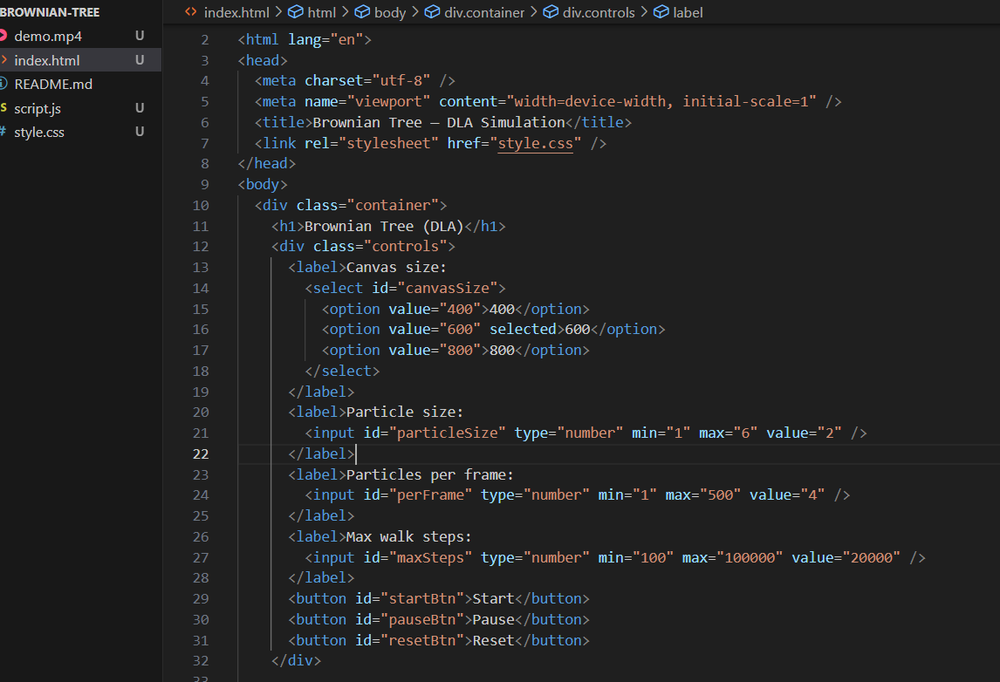

# Brownian-Tree
What I Learned=

How random walks work in simulations

What I Enjoyed Most=

Watching the fractal structure grow organically

Future Improvements=

Add different color schemes and rendering styles

[demo](demo.mp4)